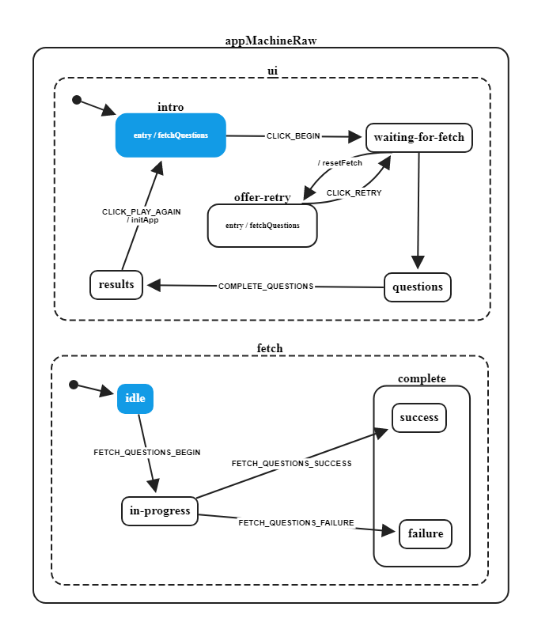

Small sample React App with big list of extras.

* [es6/babel](https://babeljs.io/) javascript transpiling
* [react](https://github.com/facebook/react) reactive ui framework
* [redux](https://github.com/reduxjs/redux) state management
* [redux-loop](https://github.com/redux-loop/redux-loop) elm-inspired explicit side-effects
* [reselect](https://github.com/reduxjs/reselect) make selectors not stupid
* [xstate](https://github.com/davidkpiano/xstate) hierarchical state machines
* [immer](https://github.com/mweststrate/immer) automatic immutability with copy-on-write proxy
* [flow](https://github.com/facebook/flow) optional type checking
* [styled components](https://github.com/styled-components/styled-components) css
    (backup: emotion)
* [rebass](http://jxnblk.com/rebass/)
* [express](https://daveceddia.com/create-react-app-express-backend/) js back-end
* [redux-debounced](https://github.com/ryanseddon/redux-debounced) debounce redux actions

[react-transition-group v2.4.x+] animation
    http://reactcommunity.org/react-transition-group/transition/
    (backup: https://github.com/wikiwi/react-css-transition | https://wikiwi.github.io/react-css-transition/)
    (backup: https://github.com/marnusw/react-css-transition-replace)

    https://github.com/aholachek/react-animation-comparison/blob/master/src/react-transition-group-anime-example.js
    https://stackoverflow.com/questions/48373298/react-transition-group-and-animations

### TODO

    ant design (rebass first)      
    http://mongodb.design/#/ui-design-system/components/buttons    
    https://atlaskit.atlassian.com/packages/core/select
    http://react-day-picker.js.org/
    material ui (meh)

* redux oriented router (redux-first-router?)
* https://github.com/acdlite/recompose/blob/master/docs/API.md#branch
* PWA
* [FSA](https://github.com/redux-utilities/flux-standard-action)
* jest
* https://github.com/acdlite/redux-batched-updates
* react-virtualized

* heroku
https://daveceddia.com/deploy-react-express-app-heroku/

* ~custom rebass theme similar to this: https://www.bluefin.com/contact/

statechart links:
https://commons.apache.org/proper/commons-scxml/guide/scxml-documents.html
https://doc.qt.io/qt-5.9/qtscxml-pinball-example.html
https://pythonhosted.org/sismic/format.html

new html:
https://css-tricks.com/snippets/css/a-guide-to-flexbox/
https://www.w3.org/TR/css-flexbox-1/images/rel-vs-abs-flex.svg
https://codepen.io/chriscoyier/pen/vWEMWw?editors=1100
https://developer.mozilla.org/en-US/docs/Web/CSS/CSS_Flexible_Box_Layout/Typical_Use_Cases_of_Flexbox

other:
https://reactjs.org/docs/composition-vs-inheritance.html

auth without firebase:
http://www.passportjs.org/docs/oauth2-api/

https://github.com/bvaughn/react-virtualized
    https://github.com/developerdizzle/react-virtual-list
